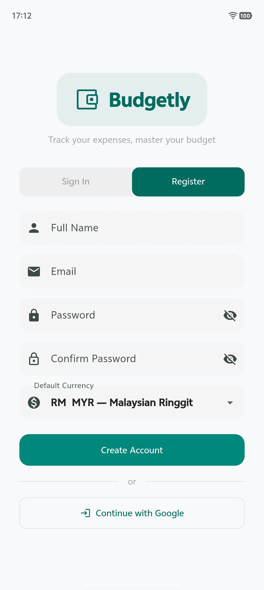
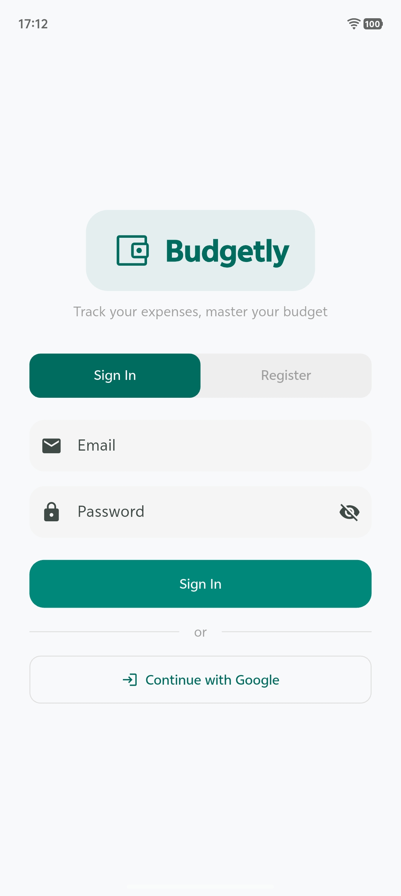
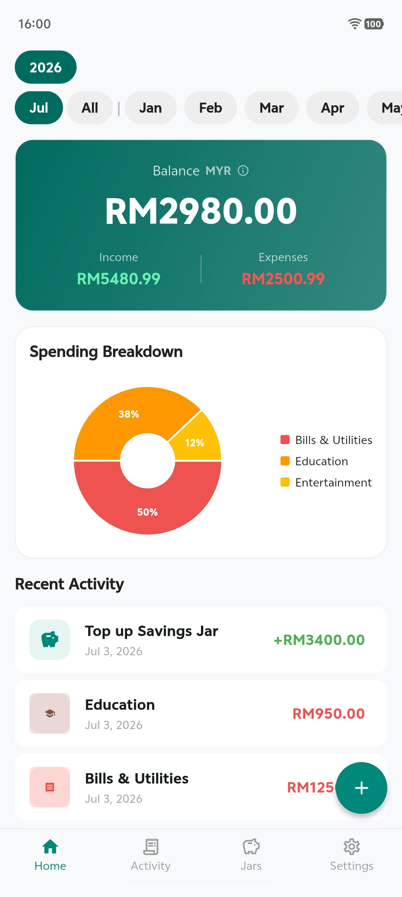
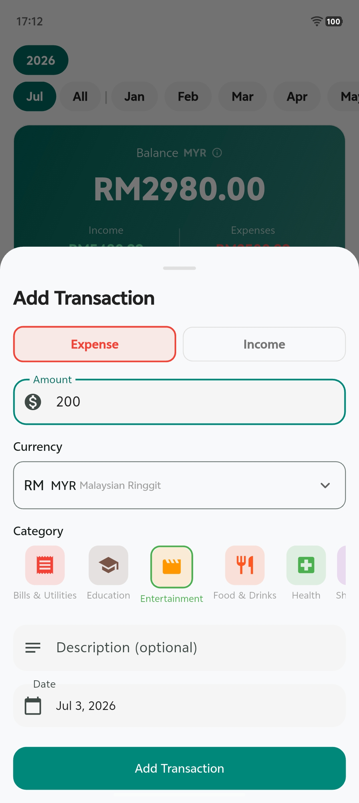
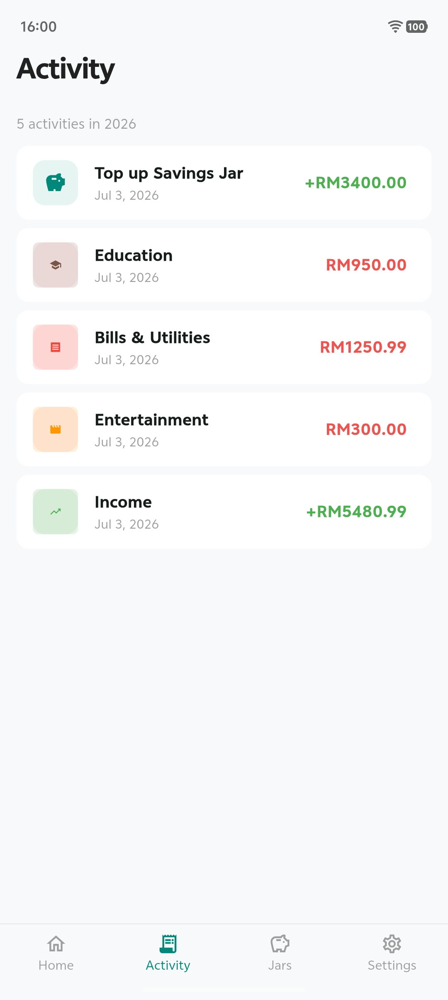
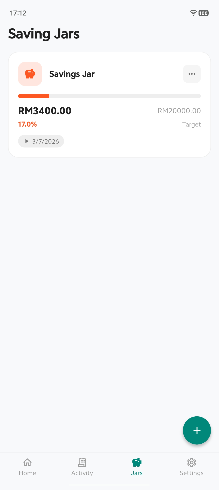

 

  

<h3 align="center">Budgetly</h3>

  

A personal finance tracker to manage budgets, track transactions, and save toward goals.
     
  

    <h1 align="center">Preview</h1>

  <table>
    <tr>
      <td></td>
      <td></td>
      <td></td>
    </tr>
    <tr>
      <td></td>
      <td></td>
      <td></td>
    </tr>
    <tr>
      <td align="center" colspan="1"></td>
    </tr>
  </table>

### Built With

[![Flutter][Flutter]][Flutter-url] [![Dart][Dart]][Dart-url] [![Firebase][Firebase]][Firebase-url]

### LICENSE

### Disclaimer
This project is for educational purposes as part of CSC264 coursework. It is not intended for production use.

[Flutter]: https://img.shields.io/badge/Flutter-02569B?style=for-the-badge&logo=flutter&logoColor=white
[Flutter-url]: https://flutter.dev/

[Dart]: https://img.shields.io/badge/Dart-0175C2?style=for-the-badge&logo=dart&logoColor=white
[Dart-url]: https://dart.dev/

[Firebase]: https://img.shields.io/badge/Firebase-FFCA28?style=for-the-badge&logo=firebase&logoColor=black
[Firebase-url]: https://firebase.google.com/
